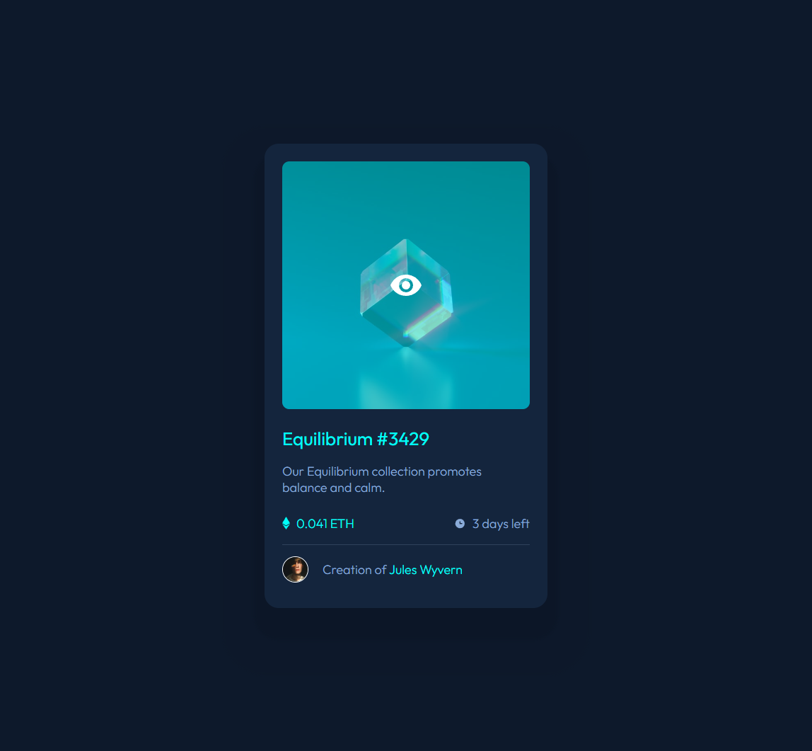
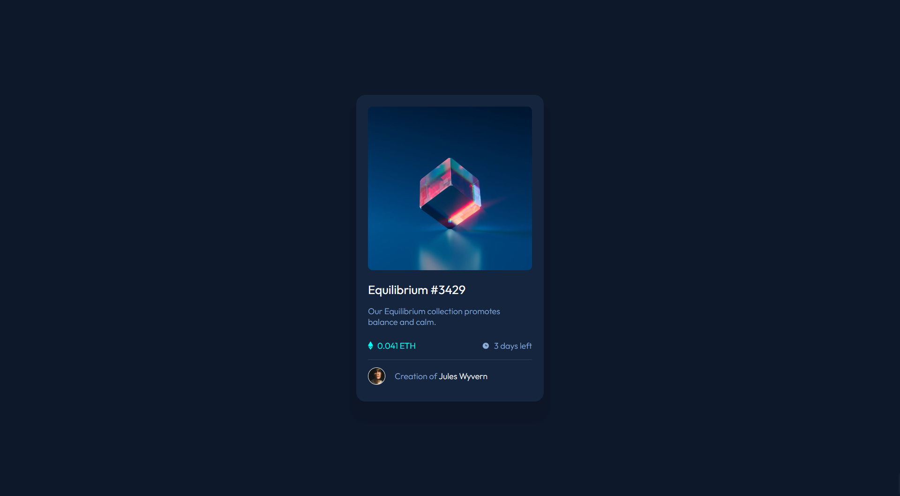

# Frontend Mentor - Blog preview card solution

This is a solution to the [Blog preview card challenge on Frontend Mentor](https://www.frontendmentor.io/challenges/blog-preview-card-ckPaj01IcS). Frontend Mentor challenges help you improve your coding skills by building realistic projects. 

## Table of contents
  - [Screenshot](#screenshot)
  - [Links](#links)
- [My process](#my-process)
  - [Built with](#built-with)
  - [What I learned](#what-i-learned)
  - [Useful resources](#useful-resources)
- [Author](#author)

### Screenshot

### Links

- Solution URL: https://github.com/TheGroobi/blog-preview-card
- Live Site URL: https://blog-preview-card-weld.vercel.app

## My process
The start was pretty easy, but i got stuck on the icons trying to display them in one line with the text. And Later the :hover function with overlay on an image was really hard for me to figure out.
### Built with

- Semantic HTML5 markup
- CSS custom properties
- Flexbox

### What I learned

That i can use multiple drop shadows, how to make color overlay on hover and still getting better at positioning and layout.

### Useful resources

- [Overlay](https://www.w3schools.com/howto/howto_css_image_overlay.asp) - Came in very handy with overlays on :hover function.
- [Box Shadow](https://stackoverflow.com/questions/49189622/css-create-multiple-box-shadow) - Didn't know you could do multiple box shadows.

## Author

- Frontend Mentor - [@TheGroobi](https://www.frontendmentor.io/profile/TheGroobi)